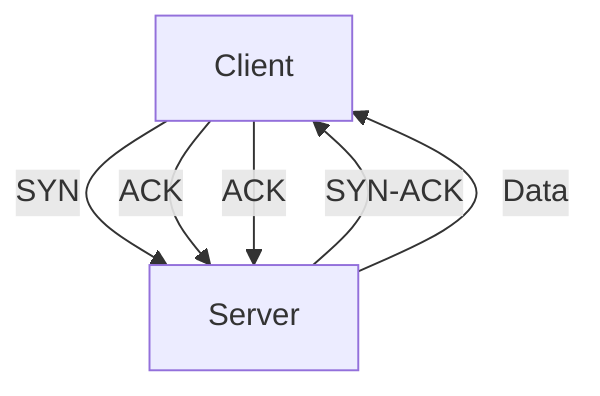
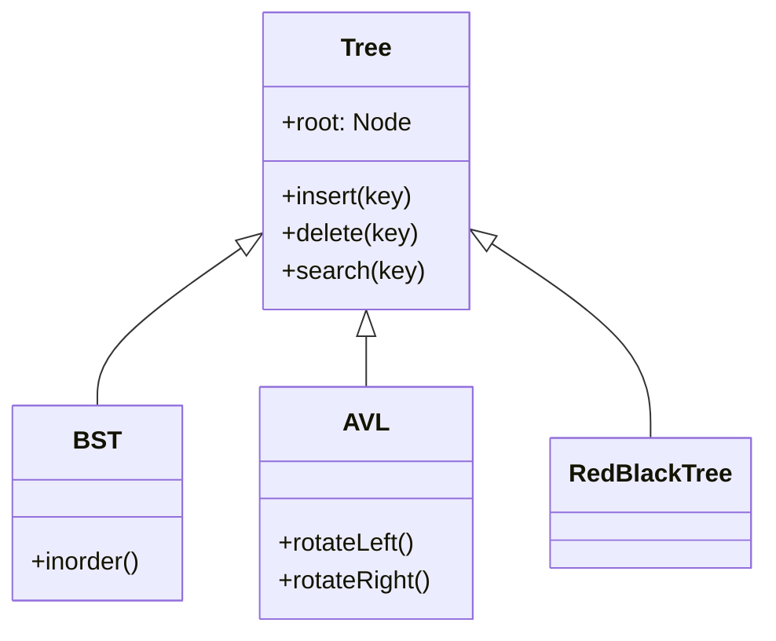
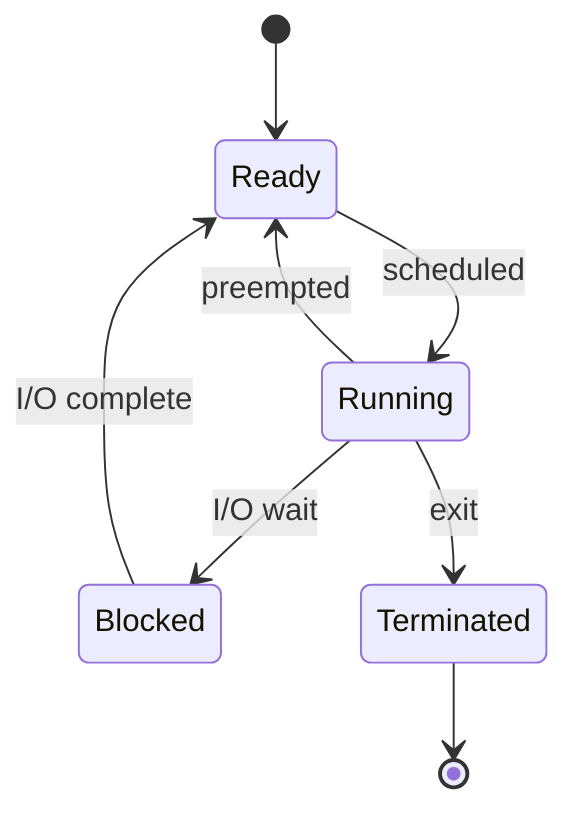
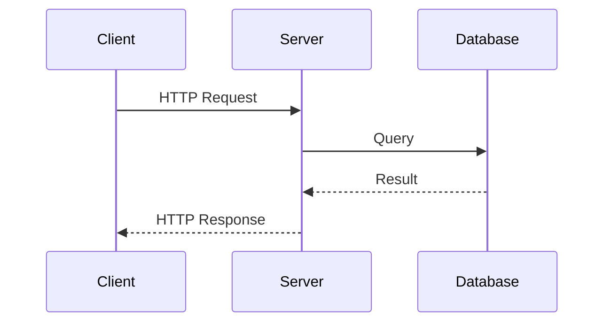

# Output Schema -- CS Knowledge Base Document Template

This document defines the exact structure, formatting rules, and conventions for
the generated knowledge base Markdown file.

---

## Document Template

```markdown
# [Topic Name] -- Knowledge Base (知识库)

> **生成日期**: YYYY-MM-DD
> **源文件**: [file1.md, file2.md, ...]

---

## 目录 (Table of Contents)

<!-- TOC generated in Phase 4; numbered, hierarchical -->

---

## 概念关系图 (Concept Map)

```mermaid
[mindmap / flowchart / classDiagram / stateDiagram]
```

---

## [Chapter numbers and content from Phase 4 structure]

<!-- Each chapter follows the section template below -->

---

## 术语表 (Glossary)

| English Term | 中文术语 | 定义 |
|-------------|---------|------|
| ... | ... | ... |

---

## 交叉引用索引 (Cross-Reference Index)

<!-- List of "See also" relationships between sections -->

---

```

---

## Section Template (for each H2/H3 chapter)

Every content section follows this pattern. No metadata tags -- the content
itself is self-explanatory.

```markdown
## N. Section Title

**Why** -- motivation, historical context, what problem it solves

**How** -- mechanism, derivation, design rationale, proof sketch

**What** -- formal definition, pseudocode, complexity, code examples, comparisons

### N.1 Subsection (if needed)

[Content]

### N.m 小结 (Summary)

[1-3 sentence summary of key takeaways]
```

Sections open directly with Why. No difficulty badges, no prerequisite labels,
no type tags. Concept ordering (prerequisites before dependents) is the only
mechanism for signaling learning dependencies.

---

## Code Block Conventions

### Language Selection Decision Tree

Apply in order. The first matching rule wins:

1. **User-specified language** — highest priority, applies globally to the entire document
2. **AI / Machine Learning** → Python (de facto standard in academia and industry)
3. **SQL queries** (DDL / DML / EXPLAIN) → SQL
4. **Low-level CS** (pointers, memory management, syscalls, hardware interaction, kernel data structures) → C
5. **Application-layer** (frameworks, business logic, API calls, toolchains, project structure) → TypeScript / JavaScript
6. **Default fallback** → TypeScript / JavaScript

### C Language Code

Use for low-level CS concepts. Show struct definitions, pointer operations, and
system-level logic:

````markdown
```c
#include <stdlib.h>
#include <stdio.h>

typedef struct Node {
    int key;
    struct Node *left;
    struct Node *right;
} Node;

Node* create_node(int key) {
    Node* n = (Node*)malloc(sizeof(Node));
    n->key = key;
    n->left = n->right = NULL;
    return n;
}

Node* insert(Node* root, int key) {
    if (root == NULL) return create_node(key);
    if (key < root->key)
        root->left = insert(root->left, key);
    else if (key > root->key)
        root->right = insert(root->right, key);
    return root;
}
```
````

### TypeScript / JavaScript Code

Use for application-layer concepts. Prefer TypeScript for type safety and
clarity; use JavaScript for concise examples:

````markdown
```typescript
class LRUCache<K, V> {
  private capacity: number;
  private map: Map<K, ListNode<K, V>>;
  private head: ListNode<K, V>;
  private tail: ListNode<K, V>;

  constructor(capacity: number) {
    this.capacity = capacity;
    this.map = new Map();
    this.head = new ListNode();
    this.tail = new ListNode();
    this.head.next = this.tail;
    this.tail.prev = this.head;
  }

  get(key: K): V | undefined {
    const node = this.map.get(key);
    if (!node) return undefined;
    this.moveToHead(node);
    return node.value;
  }

  put(key: K, value: V): void {
    let node = this.map.get(key);
    if (node) {
      node.value = value;
      this.moveToHead(node);
    } else {
      if (this.map.size >= this.capacity) {
        const lru = this.tail.prev!;
        this.removeNode(lru);
        this.map.delete(lru.key);
      }
      node = new ListNode(key, value);
      this.addToHead(node);
      this.map.set(key, node);
    }
  }

  // ... helper methods (removeNode, addToHead, moveToHead)
}
```
````

### SQL (for Database Topics)

````markdown
```sql
SELECT e.name, d.department_name
FROM employees e
INNER JOIN departments d ON e.dept_id = d.id
WHERE e.salary > (
    SELECT AVG(salary) FROM employees WHERE dept_id = e.dept_id
)
ORDER BY e.salary DESC;
```
````

### Pseudocode

Use standard algorithmic notation. Indent with 2 spaces. Use <- for assignment:

````markdown
```pseudocode
DIJKSTRA(G, s)
 1  for each vertex v in G.V
 2      dist[v] <- INF
 3      prev[v] <- NIL
 4  dist[s] <- 0
 5  Q <- G.V
 6  while Q is not empty
 7      u <- EXTRACT-MIN(Q)
 8      for each v in G.Adj[u]
 9          if dist[v] > dist[u] + w(u, v)
10              dist[v] <- dist[u] + w(u, v)
11              prev[v] <- u
12  return dist, prev
```
````

### Shell Commands

````markdown
```bash
$ gcc -O2 -Wall -o prog main.c
$ ./prog < input.txt
```
````

### Output / Console

````markdown
```text
Process  PID  CPU%  Mem%
sshd      1234  0.1   0.2
nginx     5678  2.3   1.5
```
````

---

## LaTeX Formula Conventions

### Display Math (centered, own line)

```markdown
The time complexity of merge sort is:

$$T(n) = 2T\left(\frac{n}{2}\right) + \Theta(n)$$

Solving the recurrence yields $T(n) = \Theta(n \log n)$.
```

### Inline Math

Use single `$` for inline symbols and short expressions:

```markdown
The array $A[1..n]$ is partitioned around pivot $p = A[r]$, resulting in
subarrays of size $k$ and $n-k-1$ respectively.
```

### Common CS Notation

| Concept | LaTeX | Rendered |
|---------|-------|----------|
| Big-O | `$O(n \log n)$` | $O(n \log n)$ |
| Theta | `$\Theta(n^2)$` | $\Theta(n^2)$ |
| Omega | `$\Omega(2^n)$` | $\Omega(2^n)$ |
| Summation | `$\sum_{i=1}^{n} i = \frac{n(n+1)}{2}$` | $\sum_{i=1}^{n} i = \frac{n(n+1)}{2}$ |
| Floor/Ceil | `$\lfloor x \rfloor$, $\lceil x \rceil$` | $\lfloor x \rfloor$, $\lceil x \rceil$ |
| Set notation | `$\{x \mid x \in S \land P(x)\}$` | $\{x \mid x \in S \land P(x)\}$ |
| Logarithm | `$\log_2 n$, $\ln n$` | $\log_2 n$, $\ln n$ |
| Arrow | `$\rightarrow$, $\Rightarrow$, $\leftarrow$` | $\rightarrow$, $\Rightarrow$, $\leftarrow$ |
| Subscript/Superscript | `$a_i$, $x^{2}$` | $a_i$, $x^{2}$ |
| Matrix | `$\begin{pmatrix} a & b \\ c & d \end{pmatrix}$` | Matrix |
| Probability | `$\Pr[X \geq k] \leq \frac{E[X]}{k}$` | Markov bound |

---

## Comparison Table Format

Use when comparing related concepts, protocols, or algorithms:

```markdown
| 维度 | [Option A] | [Option B] | [Option C] |
|------|-----------|-----------|-----------|
| **特性1** | ... | ... | ... |
| **特性2** | ... | ... | ... |
| **时间复杂度** | $O(n)$ | $O(n \log n)$ | $O(n^2)$ |
| **空间复杂度** | $O(1)$ | $O(n)$ | $O(n)$ |
| **适用场景** | ... | ... | ... |
| **优点** | ... | ... | ... |
| **缺点** | ... | ... | ... |
```

**Example -- TCP vs UDP:**

```markdown
| 维度 | TCP | UDP |
|------|-----|-----|
| **连接模型** | 面向连接 (Connection-oriented) | 无连接 (Connectionless) |
| **可靠性** | 可靠 -- 确认、重传、序号 | 不可靠 -- 尽力交付 |
| **顺序保证** | 有序 | 无序 |
| **拥塞控制** | 有 (AIMD, slow start...) | 无 |
| **头部开销** | 20-60 bytes | 8 bytes |
| **适用场景** | HTTP, SSH, FTP, Email | DNS, VoIP, 视频流, 游戏 |
```

---

## Mermaid Diagram Conventions

### Flowchart (protocols, processes, pipelines)

````markdown

````

### Class Diagram (data structures, design patterns, type hierarchies)

````markdown

````

### State Diagram (process states, protocol states, automata)

````markdown

````

### Sequence Diagram (request-response, RPC, message passing)

````markdown

````

---

## Glossary Format

```markdown
## 术语表 (Glossary)

| English Term | 中文术语 | 定义 |
|-------------|---------|------|
| Abstract Syntax Tree (AST) | 抽象语法树 | 源代码语法结构的树形表示，每个节点对应一个语法构造 |
| Backpropagation | 反向传播 | 通过链式法则计算神经网络中每个参数梯度的算法 |
| Context-Free Grammar (CFG) | 上下文无关文法 | 形式文法的一种，产生式左侧为单个非终结符 |
| Deadlock | 死锁 | 两个或多个进程互相等待对方释放资源而无限阻塞的状态 |
| ... | ... | ... |
```

- Alphabetically sorted by English term
- English term includes common abbreviation in parentheses: `Abstract Syntax Tree (AST)`
- 中文术语 is the widely-accepted translation; if multiple exist, use the most common one and note alternatives
- 定义 is a concise one-sentence definition in Chinese
