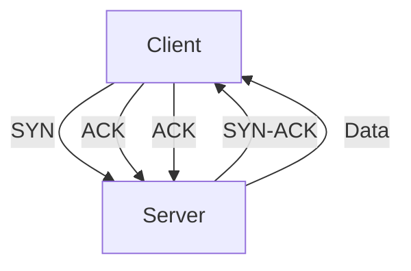
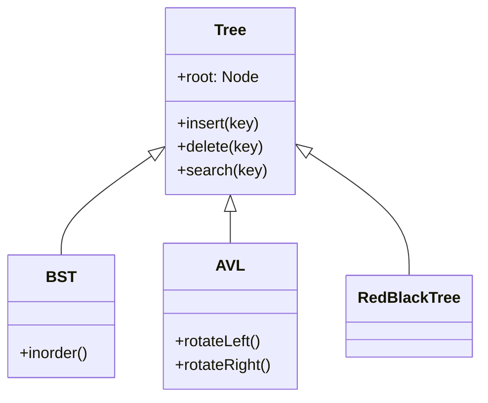
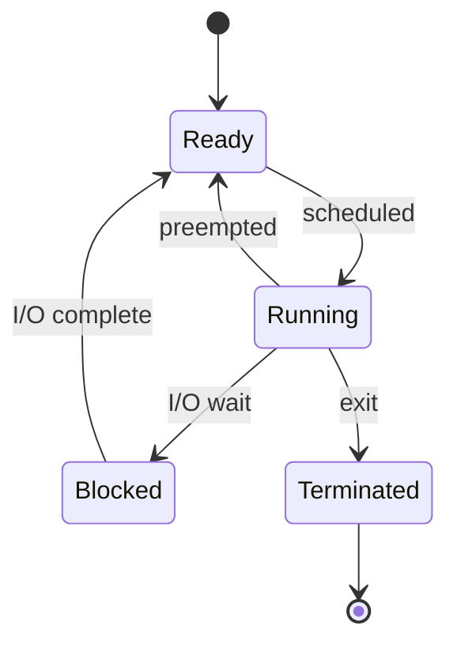
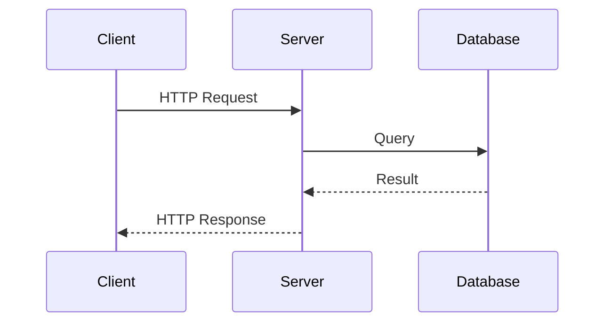

# Output Schema — CS Knowledge Base Document Template

This document defines the exact structure, formatting rules, and conventions for
the generated knowledge base Markdown file.

---

## Document Template

```markdown
# [Topic Name] — 知识库 (Knowledge Base)

> **生成日期**: YYYY-MM-DD
> **CS 子领域**: [子领域标签, 逗号分隔]
> **难度范围**: [入门] ~ [高级]
> **源文件**: [file1.md, file2.md, ...]
> **生成工具**: Notes Refiner Skill (Claude Code)

---

## 目录 (Table of Contents)

<!-- TOC generated in Phase 4; numbered, hierarchical -->

---

## 概念关系图 (Concept Map)

```mermaid
[mindmap / flowchart / classDiagram / stateDiagram]
```

---

## [Chapter numbers and content from Phase 4 structure]

<!-- Each chapter follows the section template below -->

---

## 术语表 (Glossary)

| English Term | 中文术语 | 定义 |
|-------------|---------|------|
| ... | ... | ... |

---

## 交叉引用索引 (Cross-Reference Index)

<!-- List of "See also" relationships between sections -->

---

## 经典问题与练习 (Classic Problems & Exercises)

<!-- Relevant exam/interview problems with hints -->

---

## 延伸阅读 (Further Reading)

<!-- Textbooks, papers, RFCs, official docs -->
```

---

## Section Template (for each H2/H3 chapter)

Every content section should follow this pattern:

```markdown
## N. Section Title

> **难度**: 入门 / 进阶 / 高级
> **前置要求**: [Section X.Y] or 无
> **类型**: 定义 / 推导 / 算法 / 应用 / 比较 / 历史 / 系统设计

[Content body — mix of prose, formulas, code, tables, diagrams as appropriate]

### N.1 Subsection (if needed)

[Content]

### N.m 小结 (Summary)

[1-3 sentence summary of key takeaways]
```

---

## Code Block Conventions

### Programming Language Code

Always specify the language:

````markdown
```python
def dijkstra(graph, start):
    distances = {node: float('inf') for node in graph}
    distances[start] = 0
    # ...
```
````

### Pseudocode

Use standard algorithmic notation. Indent with 2 spaces. Use ← for assignment:

````markdown
```pseudocode
DIJKSTRA(G, s)
 1  for each vertex v ∈ G.V
 2      dist[v] ← ∞
 3      prev[v] ← NIL
 4  dist[s] ← 0
 5  Q ← G.V
 6  while Q ≠ ∅
 7      u ← EXTRACT-MIN(Q)
 8      for each v ∈ G.Adj[u]
 9          if dist[v] > dist[u] + w(u, v)
10              dist[v] ← dist[u] + w(u, v)
11              prev[v] ← u
12  return dist, prev
```
````

### Shell Commands

````markdown
```bash
$ gcc -O2 -Wall -o prog main.c
$ ./prog < input.txt
```
````

### Output / Console

````markdown
```text
Process  PID  CPU%  Mem%
sshd      1234  0.1   0.2
nginx     5678  2.3   1.5
```
````

---

## LaTeX Formula Conventions

### Display Math (centered, own line)

```markdown
The time complexity of merge sort is:

$$T(n) = 2T\left(\frac{n}{2}\right) + \Theta(n)$$

Solving the recurrence yields $T(n) = \Theta(n \log n)$.
```

### Inline Math

Use single `$` for inline symbols and short expressions:

```markdown
The array $A[1..n]$ is partitioned around pivot $p = A[r]$, resulting in
subarrays of size $k$ and $n-k-1$ respectively.
```

### Common CS Notation

| Concept | LaTeX | Rendered |
|---------|-------|----------|
| Big-O | `$O(n \log n)$` | $O(n \log n)$ |
| Theta | `$\Theta(n^2)$` | $\Theta(n^2)$ |
| Omega | `$\Omega(2^n)$` | $\Omega(2^n)$ |
| Summation | `$\sum_{i=1}^{n} i = \frac{n(n+1)}{2}$` | $\sum_{i=1}^{n} i = \frac{n(n+1)}{2}$ |
| Floor/Ceil | `$\lfloor x \rfloor$, $\lceil x \rceil$` | $\lfloor x \rfloor$, $\lceil x \rceil$ |
| Set notation | `$\{x \mid x \in S \land P(x)\}$` | $\{x \mid x \in S \land P(x)\}$ |
| Logarithm | `$\log_2 n$, $\ln n$` | $\log_2 n$, $\ln n$ |
| Arrow | `$\rightarrow$, $\Rightarrow$, $\leftarrow$` | $\rightarrow$, $\Rightarrow$, $\leftarrow$ |
| Subscript/Superscript | `$a_i$, $x^{2}$` | $a_i$, $x^{2}$ |
| Matrix | `$\begin{pmatrix} a & b \\ c & d \end{pmatrix}$` | Matrix |
| Probability | `$\Pr[X \geq k] \leq \frac{E[X]}{k}$` | Markov bound |

---

## Comparison Table Format

Use when comparing related concepts, protocols, or algorithms:

```markdown
| 维度 | [Option A] | [Option B] | [Option C] |
|------|-----------|-----------|-----------|
| **特性1** | ... | ... | ... |
| **特性2** | ... | ... | ... |
| **时间复杂度** | $O(n)$ | $O(n \log n)$ | $O(n^2)$ |
| **空间复杂度** | $O(1)$ | $O(n)$ | $O(n)$ |
| **适用场景** | ... | ... | ... |
| **优点** | ... | ... | ... |
| **缺点** | ... | ... | ... |
```

**Example — TCP vs UDP:**

```markdown
| 维度 | TCP | UDP |
|------|-----|-----|
| **连接模型** | 面向连接 (Connection-oriented) | 无连接 (Connectionless) |
| **可靠性** | 可靠 — 确认、重传、序号 | 不可靠 — 尽力交付 |
| **顺序保证** | 有序 | 无序 |
| **拥塞控制** | 有 (AIMD, slow start...) | 无 |
| **头部开销** | 20-60 bytes | 8 bytes |
| **适用场景** | HTTP, SSH, FTP, Email | DNS, VoIP, 视频流, 游戏 |
```

---

## Mermaid Diagram Conventions

### Flowchart (protocols, processes, pipelines)

````markdown

````

### Class Diagram (data structures, design patterns, type hierarchies)

````markdown

````

### State Diagram (process states, protocol states, automata)

````markdown

````

### Sequence Diagram (request-response, RPC, message passing)

````markdown

````

---

## Glossary Format

```markdown
## 术语表 (Glossary)

| English Term | 中文术语 | 定义 |
|-------------|---------|------|
| Abstract Syntax Tree (AST) | 抽象语法树 | 源代码语法结构的树形表示，每个节点对应一个语法构造 |
| Backpropagation | 反向传播 | 通过链式法则计算神经网络中每个参数梯度的算法 |
| Context-Free Grammar (CFG) | 上下文无关文法 | 形式文法的一种，产生式左侧为单个非终结符 |
| Deadlock | 死锁 | 两个或多个进程互相等待对方释放资源而无限阻塞的状态 |
| ... | ... | ... |
```

- Alphabetically sorted by English term
- English term includes common abbreviation in parentheses: `Abstract Syntax Tree (AST)`
- 中文术语 is the widely-accepted translation; if multiple exist, use the most common one and note alternatives
- 定义 is a concise one-sentence definition in Chinese

---

## Further Reading Format

```markdown
## 延伸阅读 (Further Reading)

### 经典教材

| 教材 | 相关章节 | 说明 |
|------|---------|------|
| **Introduction to Algorithms** (CLRS), 4th Ed. | Ch. 22-24 | 图算法标准参考，包含严格的复杂度证明 |
| **Computer Networking: A Top-Down Approach** (Kurose & Ross), 8th Ed. | Ch. 3 | 运输层协议的详细讲解，含 Wireshark 实验 |
| ... | ... | ... |

### 学术论文

| 论文 | DOI / 链接 | 说明 |
|------|-----------|------|
| Dijkstra, E. W. (1959). "A Note on Two Problems in Connexion with Graphs." *Numerische Mathematik*, 1:269-271. | [10.1007/BF01386390](https://doi.org/10.1007/BF01386390) | Dijkstra 最短路径算法原始论文 |
| ... | ... | ... |

### RFC

| RFC | 标题 | 说明 |
|-----|------|------|
| RFC 793 | Transmission Control Protocol | TCP 协议规范 |
| ... | ... | ... |

### 在线资源

- [资源名称] — [URL] — [一句话描述]
```
